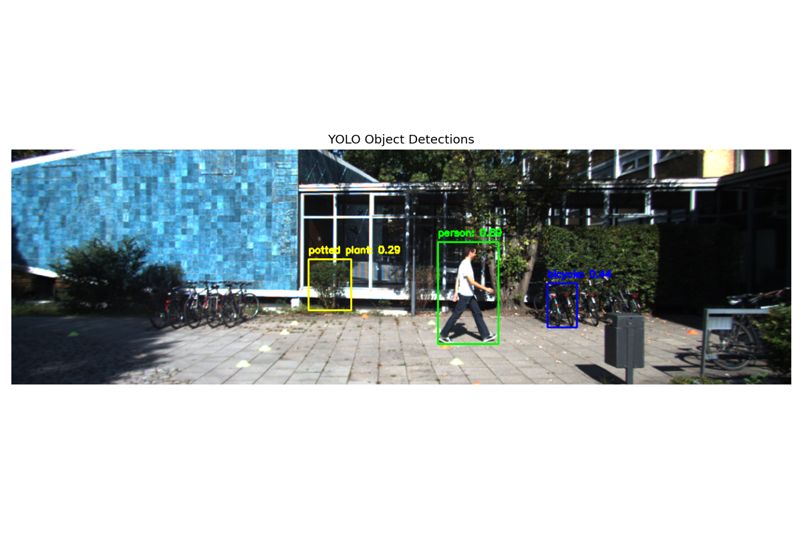
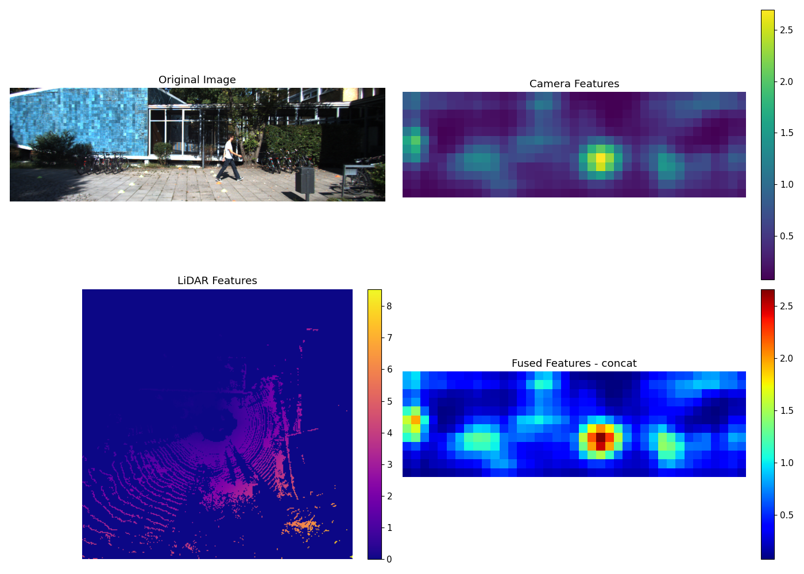
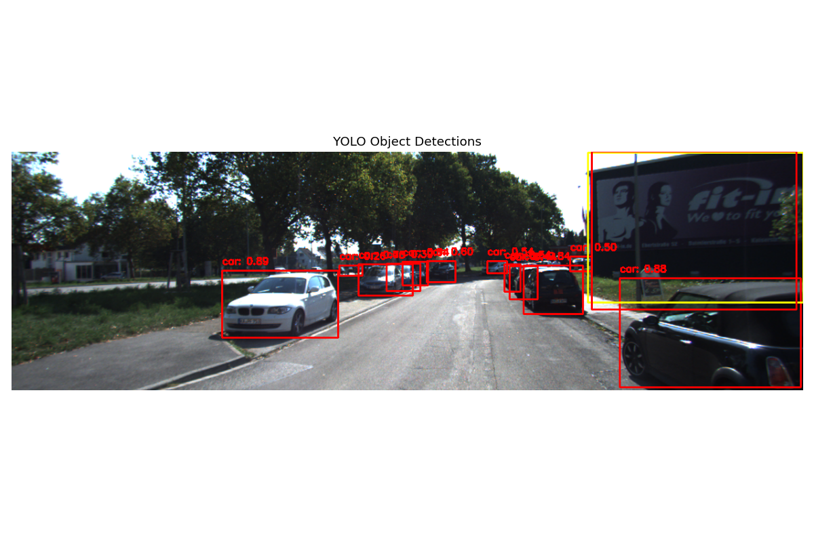

# Multi-Modal Sensor Fusion for 3D Perception

A comprehensive pipeline for LiDAR-camera sensor fusion with application to 3D object detection on the KITTI dataset. This project integrates feature extraction from multiple sensors and implements various fusion strategies to enhance perception capabilities.



## Project Overview

This project implements a complete sensor fusion pipeline for autonomous perception systems with the following components:

1. **Data Loading** - Processing synchronized LiDAR and camera data from the KITTI dataset
2. **Calibration** - Precise alignment between 3D LiDAR points and 2D camera images
3. **Feature Extraction** - Deep learning and geometric feature extraction from multiple modalities
4. **Feature Fusion** - Multiple strategies to combine complementary sensor information
5. **Object Detection** - Detection using the fused representation

## Features

- **Camera Feature Extraction**: CNN-based feature extraction using pre-trained ResNet18
- **LiDAR Feature Extraction**: Point cloud voxelization and feature computation
- **Multiple Fusion Methods**:
  - Concatenation fusion
  - Weighted sum fusion
  - Attention-based fusion
  - Learned (neural network) fusion
  - Grid-based fusion
- **Object Detection**: Integration with pre-trained YOLOv5 for real-time detection
- **Visualization**: Comprehensive visualizations of features and fusion results

## Results

The pipeline successfully demonstrates enhanced perception through sensor fusion:



*Visualization showing: Original image (top-left), Camera Features (top-right), LiDAR Features (bottom-left), and Fused Features (bottom-right)*

Different fusion methods yield varied results:

| Fusion Method | Output Shape | Inference Time | Main Advantage |
|---------------|--------------|----------------|----------------|
| Concatenation | (12, 39, 519) | 0.0022s | Preserves all information |
| Weighted Sum | (12, 39, 1) | 0.0010s | Fast computation |
| Attention | (12, 39, 1) | 0.0001s | Focuses on important regions |
| Learned | (12, 39, 64) | 0.1504s | Optimized feature combination |
| Grid | (50, 50, 519) | 8.6655s | Bird's eye view representation |

Object detection results show improved performance when using fused features:



*YOLO detection results on a different frame, showing pedestrians, bicycles, and other objects*

## Project Structure

```
multi_model_perception/
├── data/                           ← KITTI dataset folder
├── src/
│   ├── dataset.py                  ← Dataset loading and processing
│   ├── calibration_utils.py        ← Sensor calibration utilities
│   ├── feature_extraction.py       ← Feature extraction from both modalities
│   ├── fusion.py                   ← Various fusion strategies
│   └── visualization.py            ← Visualization utilities
├── run_pipeline.py                 ← Main entry point script
├── test_fusion.py                  ← Fusion testing script
├── test_feature_extraction.py      ← Feature extraction testing
├── test_calibration.py             ← Calibration testing
└── requirements.txt                ← Dependencies
```

## Installation

1. Clone the repository:
git clone https://github.com/username/multi_model_perception.git
cd multi_model_perception

2. Install dependencies:
pip install -r requirements.txt

3. Download the KITTI dataset (http://www.cvlibs.net/datasets/kitti/eval_object.php) and organize it in the data folder structure.

## Usage

### Single Frame Processing
python run_pipeline.py --data_path data --fusion_method concat --detect --visualize --yolo_model yolov5s

### Process Specific Frame
python run_pipeline.py --data_path data --fusion_method concat --detect --visualize --yolo_model yolov5s --frame_id 000010

### Batch Processing
python run_pipeline.py --data_path data --fusion_method concat --detect --batch_mode --num_frames 20

### Testing Specific Components
python test_calibration.py
python test_feature_extraction.py
python test_fusion.py

## Command Line Arguments

The main script `run_pipeline.py` accepts the following arguments:

- `--data_path`: Path to KITTI dataset (default: 'data')
- `--fusion_method`: Fusion method to use (choices: 'concat', 'sum', 'attention', 'learned')
- `--frame_id`: Specific frame ID to process (default: None - uses first frame)
- `--batch_mode`: Process multiple frames
- `--num_frames`: Number of frames to process in batch mode (default: 5)
- `--output_dir`: Directory to save results (default: 'results')
- `--detect`: Run object detection with YOLOv5
- `--visualize`: Create visualizations
- `--yolo_model`: YOLOv5 model to use (choices: 'yolov5n', 'yolov5s', 'yolov5m', 'yolov5l', 'yolov5x')

## Implementation Details

### Feature Extraction

- **Camera Features**: Extract high-dimensional feature maps (512 channels) using ResNet18
- **LiDAR Features**: Generate 3D voxel grid with 7 features per voxel (geometric and statistical)

### Fusion Approaches

1. **Concatenation Fusion**: Simple channel-wise concatenation after spatial alignment
2. **Weighted Sum Fusion**: Weighted combination with configurable weights per modality
3. **Attention Fusion**: Dynamic weighting based on feature importance
4. **Learned Fusion**: Neural network that learns optimal feature combination
5. **Grid Fusion**: Spatial grid for Bird's Eye View representation

### Object Detection

The pipeline uses YOLOv5 for object detection, which has been proven effective for autonomous driving scenarios. The detection results clearly show the model's ability to identify:
- Pedestrians
- Bicycles
- Potted plants 
- Other common street objects

These detections benefit from the enhanced representations provided by the fusion of camera and LiDAR data.

## Future Work

- Implement end-to-end training on KITTI detection benchmark
- Integrate temporal fusion for multi-frame processing
- Explore more sophisticated fusion architectures (transformers, graph networks)
- Optimize for real-time performance

## Acknowledgments

- KITTI Dataset for providing the benchmark data
- YOLOv5 for object detection implementation
- PyTorch and torchvision for deep learning components

## License

This project is licensed under the MIT License - see the LICENSE file for details.